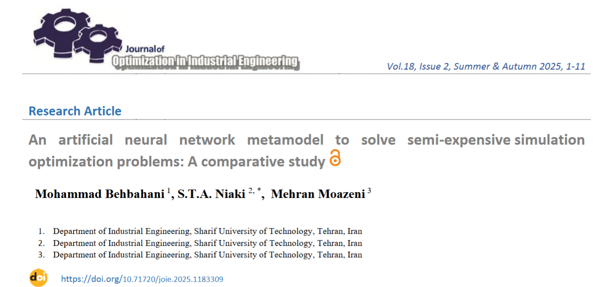
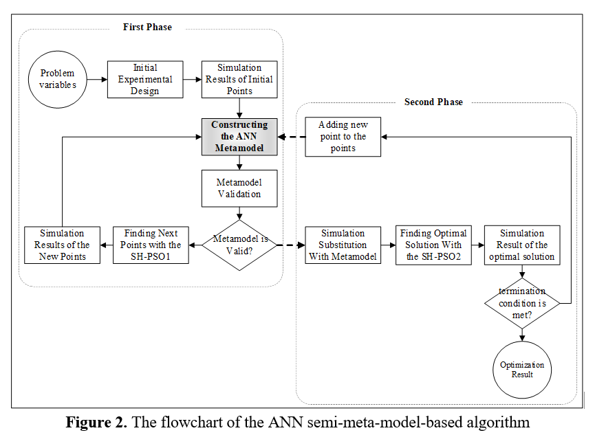

# Artificial Neural Network Metamodel for Semi-Expensive Simulation Optimization

**A Comparative Study of ANN vs. Kriging Metamodels**

> This repository contains the code and supplementary materials for an article developed as part of a Master's thesis (completed in 2018). The manuscript was accepted and published in 2025 following an extended editorial and publication process.

---

## Overview

MATLAB implementation of the **ANN-Semi-Metamodel-Based (ANN-SMB) algorithm** for semi-expensive simulation optimization. Compares ANN and Kriging metamodels in a two-phase framework for simulations taking 2–5 minutes per replication.

**New to simulation optimization?** See [Introduction to Inventory Simulation Optimization](https://www.oploy.eu/inventory-simulation-optimization/) for context.

### Key Innovation

**Two-phase approach** solving the model-based vs. metamodel-based dilemma:
- **Phase 1**: Direct simulation (faster exploration)
- **Phase 2**: Validated metamodel (efficient exploitation)

---

## Algorithm Flowchart



**Figure 2**: Two-phase ANN-SMB framework with spatial-hole PSO

---

## Main Results

### (s,S) Inventory Control Model
| Metric | ANN-SMB | Kriging-SMB |
|--------|---------|------------|
| Avg. Objective Value | **595.28** | 603.71 |
| Std. Deviation | **10.61** | 14.99 |
| Function Evaluations | 262.5 | 264 |

### Analytical Test Functions (5 Benchmarks)
| Function | ANN-SMB Superior | Kriging-SMB Superior |
|----------|-----------------|-------------------|
| Sphere | ✓ | |
| Griewank | ✓ | |
| Schaffer's F6 | ✓ | |
| Rosenbrock | ✓ | |
| Rastrigin | | ✓ |

**Key Finding**: ANN-SMB superior on 4/5 test functions with **5–10% fewer function evaluations**.

---

## Features

✅ Two-phase semi-metamodel-based optimization  
✅ Artificial Neural Network metamodel with Levenberg-Marquardt training  
✅ Spatial-Hole Particle Swarm Optimization (SH-PSO) for enhanced exploration  
✅ Leave-one-out cross-validation for metamodel validation  
✅ Comparison with Kriging-based approach  
✅ Applied to both test functions and realistic (s,S) inventory model  
✅ MATLAB 8.4+ implementation  

---

## Usage

### Prerequisites
- MATLAB 8.4 or later
- Statistics and Machine Learning Toolbox (for neural network functions)

### Running the Algorithm

```matlab
cd Main
main_core_ANN
```

Customize parameters in `main_core_ANN.m`: `idp`, `r`, `m`, `h`, `epsilon`

---

## Mathematical Framework

### ANN Architecture
```
Input Layer → Hidden Layer (tan-sigmoid) → Output Layer (linear)
```

**Transfer Functions**:
- Hidden layer: $f_{tan}(x) = \frac{2}{1 + e^{-2x}} - 1$
- Output layer: $f_{lin}(x) = x$

### Metamodel Validation
Leave-one-out cross-validation with studentized prediction error

---

## Practical Applications

**Applications**: Inventory optimization, production scheduling, logistics design

**Benefits**: 
- 5–10% fewer function evaluations
- Same-shift vs. overnight optimization
- Compatible with Arena, AnyLogic, Simio

---

## Citation

```bibtex
@article{Behbahani2025,
  author = {Mohammad Behbahani and Seyed Taghi Akhavan Niaki and Mehran Moazeni},
  title = {An artificial neural network metamodel to solve semi-expensive simulation optimization problems: A comparative study},
  journal = {Journal of Industrial Engineering},
  doi = {10.71720/joie.2025.1183309},
  year = {2025}
}
```

**DOI**: https://doi.org/10.71720/joie.2025.1183309

---

## Key Findings

- Statistically equivalent solution quality (p = 0.913)
- ANN-SMB superior on 4/5 test functions
- 5–10% reduction in function evaluations
- Real-world speedup: overnight to same-shift optimization

---

## Limitations & Future Work

**Limitations**: Tested up to 3D, ~6% neuron sensitivity, continuous/low-noise only

**Future**: RBF/regression comparison, noisy/discrete problems, real-world benchmarks

---


**Last Updated**: February 2026  
**License**: Academic Use (See paper for full terms)  
**Status**: Published
